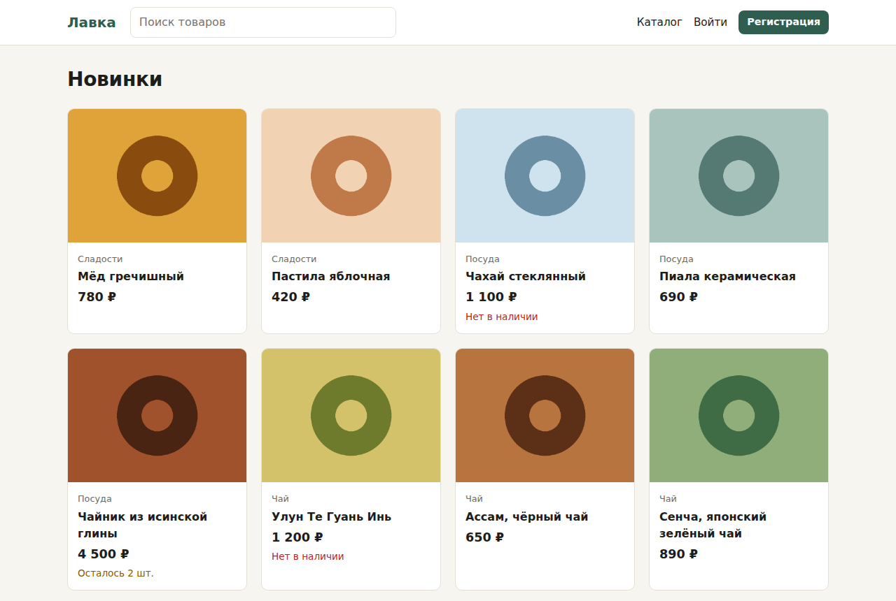
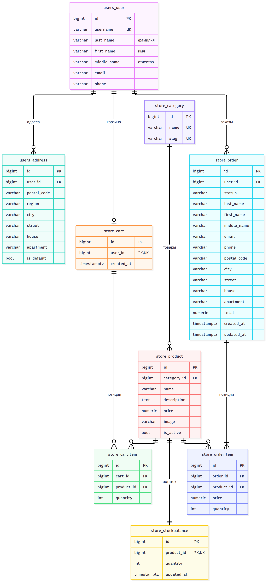

# Проект: Сайт интернет-магазина

**Имя Фамилия:** Арутюн Газарян
**Логин на GitHub:** [Arutggg](https://github.com/Arutggg)
**E-mail:** arutyun.gaz@bk.ru

---

Интернет-магазин на Django и PostgreSQL, упакованный в Docker.

- **Часть 1** (`online-store-part1`): модели, каталог, корзина, заказы, личный кабинет, management-команды.
- **Часть 2** (`online-store-part2`): Docker, автотесты и unit-тесты, рефакторинг.



## Возможности

- **Каталог.** Категории, поиск, пагинация, карточка товара: название, изображение, описание, цена и остаток.
- **Корзина.** Добавить, изменить количество, удалить. **Положить в корзину больше, чем есть на складе, нельзя**, а при оформлении заказа остаток проверяется ещё раз с блокировкой строк (`SELECT … FOR UPDATE`).
- **Заказы.** Данные получателя подставляются из профиля, остатки списываются в одной транзакции, цена фиксируется на момент покупки. В истории покупок есть фильтр «ожидают отправки / отправленные», новый или оплаченный заказ можно отменить.
- **Личный кабинет.** ФИО отдельными полями, контакты, несколько адресов доставки, регистрация, вход и выход.
- **Админка.** Товары с превью и остатками, клиенты с адресами, заказы. Статус заказа меняется действиями («Оплачен», «Передать в доставку», «Доставлен», «Отменить»), поэтому соблюдаются правила переходов.
- **Команды.** `load_goods` загружает товары, `export_product_residue` и `unload_product_residue` выгружают остатки.

## Запуск в Docker

Нужен установленный [Docker Desktop](https://www.docker.com/products/docker-desktop/).

```bash
cp .env.example .env
# в .env замените DJANGO_SECRET_KEY, новый ключ можно получить так:
python3 -c "import secrets; print(secrets.token_urlsafe(50))"

docker compose up --build
```

Сайт откроется на http://localhost:8000, админка на http://localhost:8000/admin/ (логин и пароль берутся из `DJANGO_SUPERUSER_*` в `.env`).

При старте контейнер ждёт базу, применяет миграции, загружает демо-товары, если база пустая, и создаёт администратора (`docker/entrypoint.sh`).

| Файл | Назначение |
|---|---|
| `Dockerfile` | образ приложения: зависимости, код, `collectstatic`, запуск через gunicorn от непривилегированного пользователя |
| `docker-compose.yml` | сервисы `db` (PostgreSQL 16) и `web`, тома для базы и загруженных картинок, healthcheck базы |
| `docker-compose.dev.yml` | режим разработки: код монтируется в контейнер (`.:/app`), работает `runserver` с автоперезагрузкой |
| `docker/entrypoint.sh` | ожидание базы, `migrate`, демо-данные, суперпользователь |

Режим разработки:

```bash
docker compose -f docker-compose.yml -f docker-compose.dev.yml up --build
```

Полезные команды:

```bash
docker compose exec web python manage.py test          # тесты внутри контейнера
docker compose exec web python manage.py createsuperuser
docker compose down        # остановить; добавьте -v, чтобы удалить и данные
```

Миграции выполняются при старте контейнера, а не в `Dockerfile`: во время `docker build` база данных ещё не запущена.

## Локальный запуск без Docker

```bash
python -m venv venv && source venv/bin/activate
pip install -r requirements-dev.txt
cp .env.example .env              # для локальной базы оставьте DB_HOST=localhost
python manage.py migrate
python manage.py load_goods
python manage.py createsuperuser
python manage.py runserver
```

Настройки разделены по окружениям: `online_store/settings/base.py` (общие), `dev.py` (по умолчанию для `manage.py`, `DEBUG=True`) и `production.py` (Docker и сервер: `DEBUG=False`, WhiteNoise, обязательный секретный ключ).

## Тесты

```bash
python manage.py test                      # 98 тестов
coverage run manage.py test && coverage report
flake8 && isort --check-only .
```

| Файл | Что проверяет |
|---|---|
| `store/tests/test_models.py` | модели: поля, ограничения БД (остаток ≥ 0, уникальность), корзина, заказы, выборки отправленных и неотправленных заказов |
| `store/tests/test_services.py` | **unit-тесты** бизнес-логики без HTTP: добавление в корзину, оформление и отправка заказа, отмена с возвратом на склад, правила смены статуса |
| `store/tests/test_views.py` | страницы каталога, корзины, оформления, истории заказов и админки |
| `store/tests/test_commands.py` | команды `load_goods` и `export_product_residue` |
| `users/tests/` | модель пользователя и адреса, регистрация, вход, выход, личный кабинет |

Покрытие кода — 98%. Результаты ручного тестирования записаны в [docs/testing.md](docs/testing.md).

## Рефакторинг

Что изменено и почему, описано в [docs/refactoring.md](docs/refactoring.md). Главное: бизнес-логика вынесена из представлений в `store/services.py`, чтобы её можно было тестировать отдельно от HTTP.

## Команды для товаров и остатков

```bash
python manage.py load_goods                            # store/fixtures/goods.json
python manage.py load_goods path/to/goods.json --add   # прибавить к остаткам
python manage.py load_goods --if-empty                 # только если товаров ещё нет
python manage.py export_product_residue                # остатки в JSON
python manage.py unload_product_residue --format csv -o residue.csv
python manage.py export_product_residue --format fixture -o stock.json   # для loaddata
```

## Структура базы данных

Схема и описание нормализации лежат в [docs/database.md](docs/database.md), исходник для draw.io — в [docs/db_schema.drawio](docs/db_schema.drawio).



## Структура проекта

```
online_store/settings/   настройки: base, dev, production
users/                   пользователь, адреса, регистрация, личный кабинет
store/
  models.py              каталог, склад, корзина, заказы
  services.py            бизнес-логика: корзина, заказы, статусы
  exceptions.py          ошибки бизнес-логики
  views.py               HTTP-слой: формы → сервисы → шаблоны
  management/commands/   load_goods, export_product_residue, unload_product_residue
  tests/                 тесты моделей, сервисов, страниц и команд
docker/entrypoint.sh     подготовка контейнера
docs/                    схема БД, отчёты о тестировании и рефакторинге
```

## Стек

Python 3.12, Django 5.2, PostgreSQL 16, psycopg 3, gunicorn, WhiteNoise, Docker Compose, django-admin-interface, Pillow, coverage, flake8, isort.
