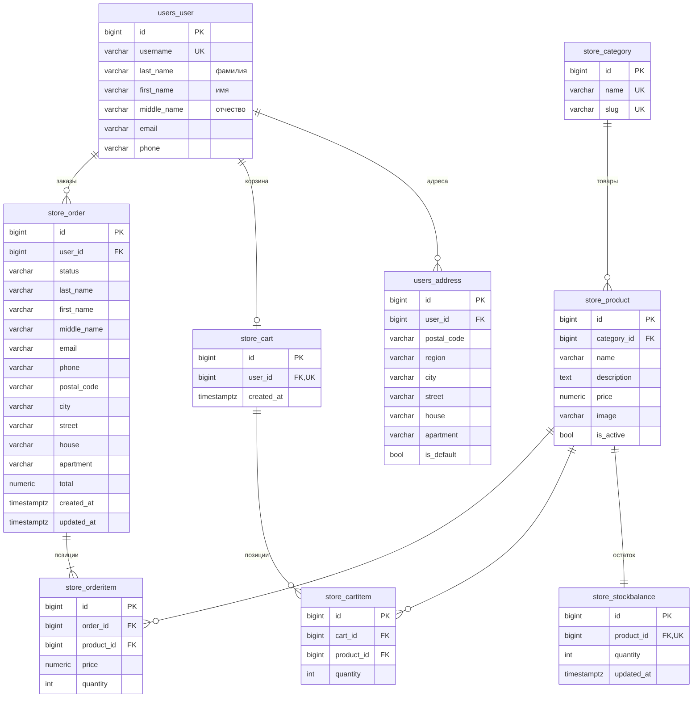

# Структура базы данных

Схема для draw.io: [`db_schema.drawio`](db_schema.drawio). Открыть её можно на app.diagrams.net через File → Open. Картинка: [`db_schema.png`](db_schema.png). Ниже та же схема в Mermaid, GitHub рисует её сам.

## Как требования заказчика ложатся на таблицы

| Требование | Где хранится |
|---|---|
| ФИО, адреса, контакты клиента | `users_user` (ФИО разбито на фамилию, имя и отчество, плюс email и телефон), `users_address` (адрес разбит на индекс, регион, город, улицу, дом и квартиру; адресов у клиента может быть несколько) |
| Название, изображение, описание, цена товара | `store_product` и справочник `store_category` |
| Остатки на складе | `store_stockbalance`: одна запись на товар (связь 1:1) |
| Корзина | `store_cart` (одна на пользователя) и `store_cartitem`. Пара «корзина + товар» уникальна |
| Статус заказа и история покупок | `store_order` (статус и даты) и `store_orderitem` |

## Решения по нормализации

- **1НФ.** В каждом поле одно атомарное значение: ФИО и адрес разбиты на отдельные поля, повторяющихся групп нет. Товары корзины и заказа вынесены в отдельные таблицы, а не лежат списком в одном поле.
- **2НФ/3НФ.** Категория вынесена в справочник, в товаре хранится только `category_id`. Остаток хранится в отдельной таблице, потому что это складская сущность, которая меняется независимо от карточки товара.
- **Осознанная денормализация в заказе.** `store_orderitem.price` хранит цену на момент покупки, а ФИО, контакты и адрес копируются в `store_order`. Если потом поменять цену товара или профиль клиента, история покупок не изменится.
- **Целостность.** Товар с заказами удалить нельзя (`ON DELETE PROTECT`). Количество не может быть отрицательным (`CHECK quantity >= 0`). Остатки при оформлении заказа блокируются через `SELECT … FOR UPDATE`, поэтому последнюю единицу товара не купят двое одновременно.
